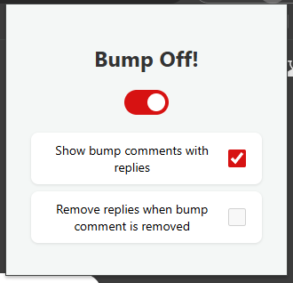

# Bump Off!

<div align="center">
    
</div>

## Overview

**Bump Off!** is a Chrome extension that automatically hides Facebook comments containing the word 'bump.' It helps keep your Facebook feed clean by filtering out 'bump' comments, which are often used to push posts back to the top of the feed without adding value.

You can:

- Enable or disable the extension.
- Choose whether to show or hide 'bump' comments that have replies *(default: show)*.
- Optionally remove replies to hidden 'bump' comments.

## Features

- **Automatically hide 'bump' comments**: All comments containing the word 'bump' are hidden from view on Facebook.
- **Toggle visibility for 'bump' comments with replies**: You can choose to show or hide 'bump' comments that have replies.
- **Remove replies to hidden 'bump' comments**: Optionally remove replies associated with hidden 'bump' comments.

## UI



## Installation

### From Chrome Web Store

Coming soon!

### Manual Installation from GitHub

1. Clone or download this repository:
    ```zsh
    git clone https://github.com/<YOUR_USERNAME>/bump-off.git
    ```
2. Open **chrome://extensions/** in your browser.
3. Enable **Developer mode** in the top-right corner.
4. Click **Load unpacked** and select the directory where you cloned the repo.
5. The extension should now appear in your toolbar. You can configure it from the popup menu.

## How to Use

1. Once installed, click the **Bump Off!** icon in the Chrome toolbar *(you may need to click the puzzle icon to find it)*.
2. Enable or disable the extension using the toggle switch.
3. Adjust other settings to customize how 'bump' comments and replies are handled.
4. Changes take effect instantly, no need to reload the page!

## Contributing

Contributions are welcome! Please refer to the [CONTRIBUTING](CONTRIBUTING.md) file for more details.

## Permissions

- **Storage**: Used to store the user's settings (e.g., enable/disable status, and visibility options).
- **Host permissions**: The extension needs access to `facebook.com` to hide comments.

## License

This project is licensed under the MIT License. See the [LICENSE](LICENSE) file for details.

## Contact

If you have any questions or feedback, feel free to reach out via [GitHub Issues](https://github.com/smarizvi/bump-off/issues).
